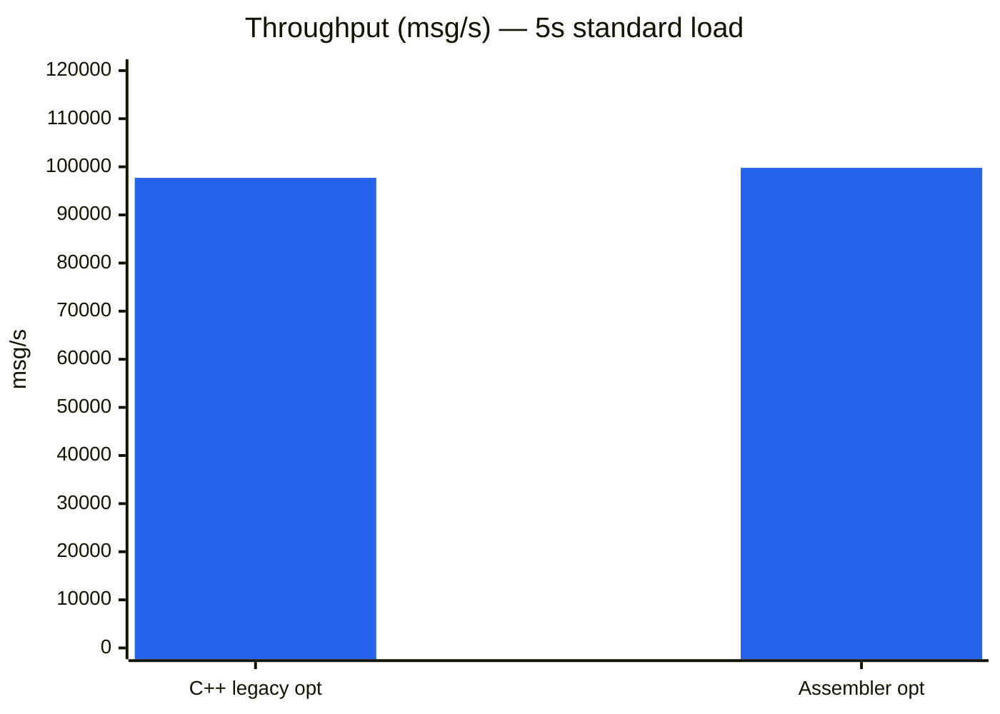
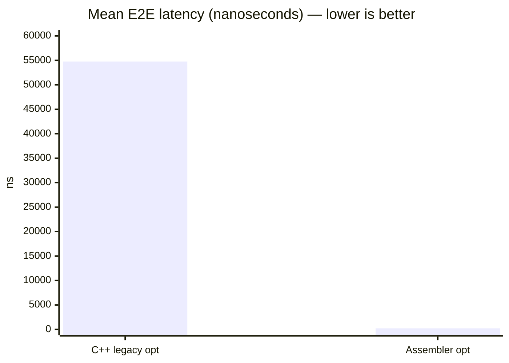
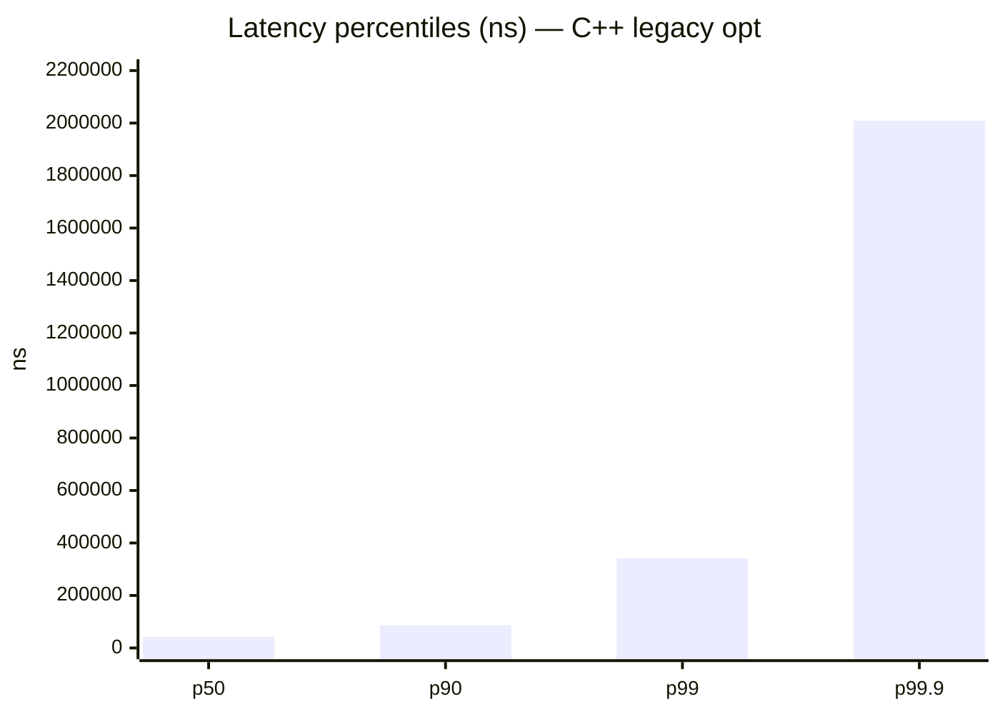
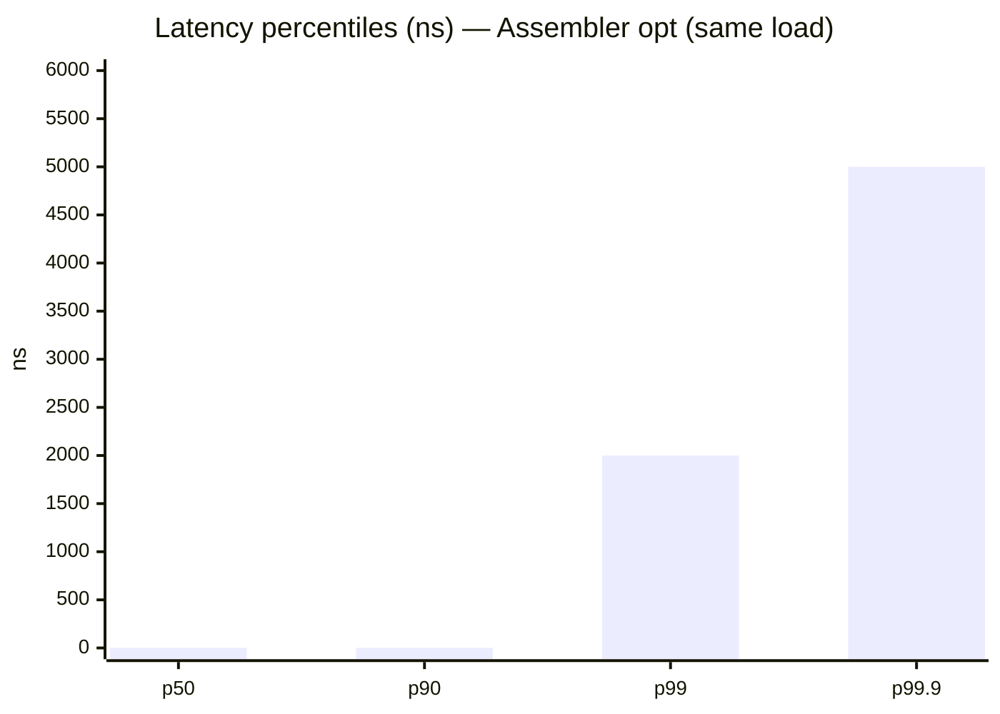
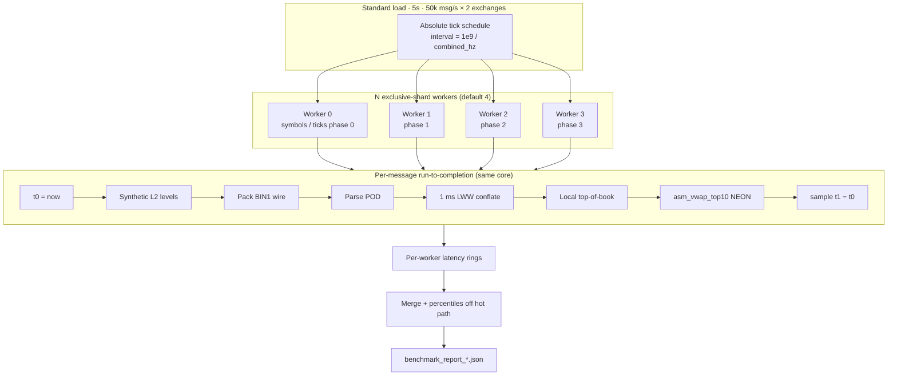
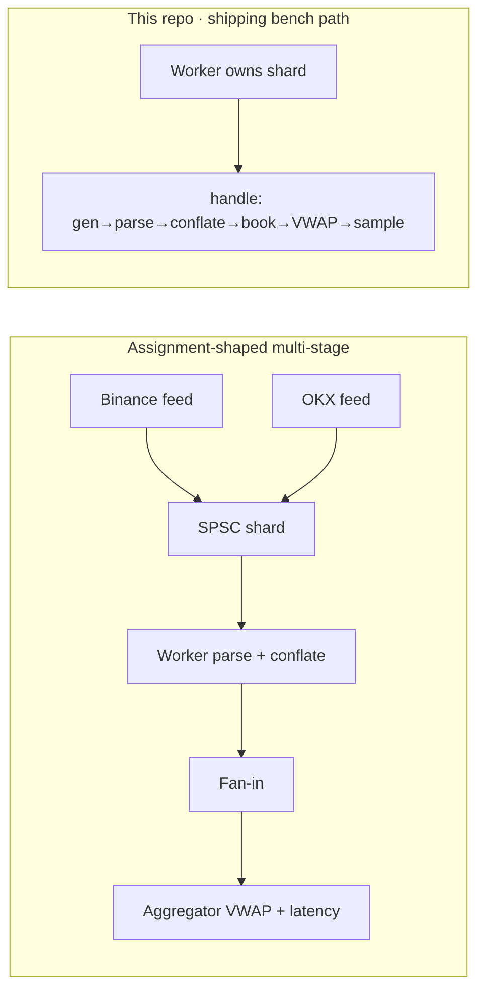
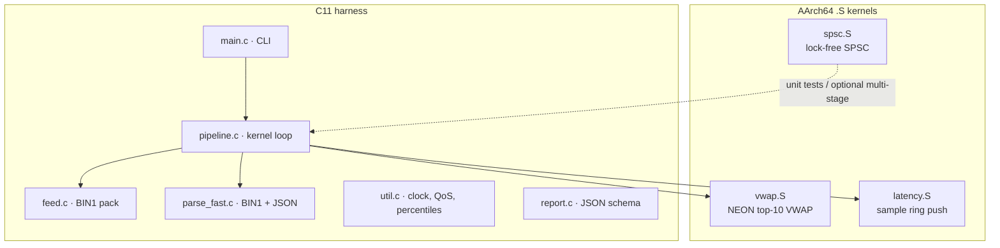
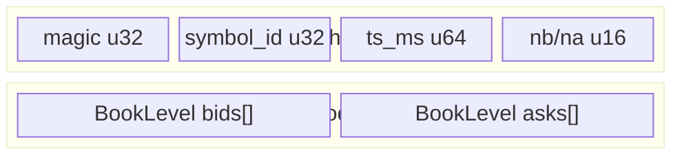
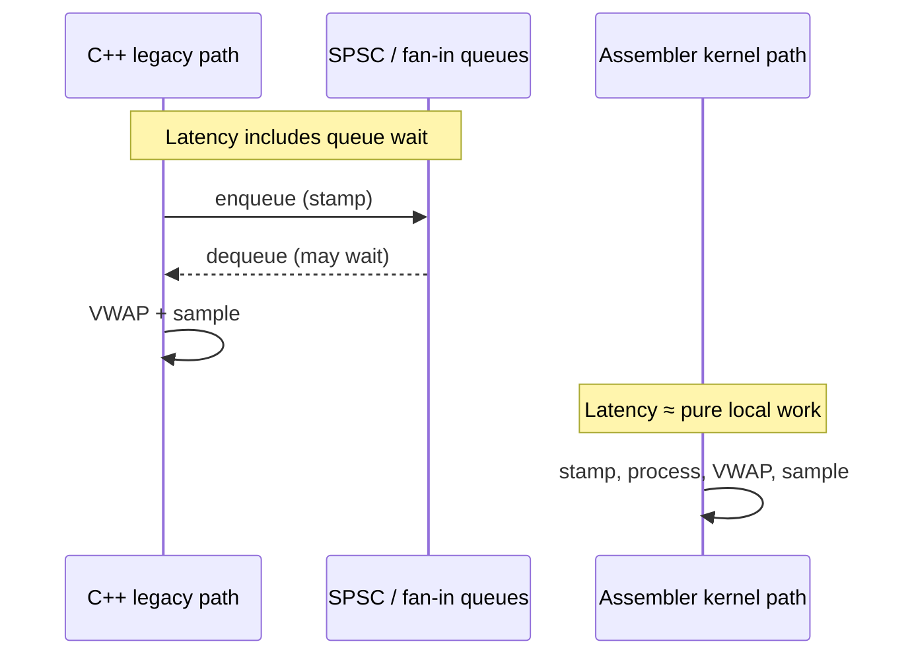

# HFT L2 Market Data Conflator — AArch64 Assembler

[](LICENSE)
[](#build)
[](#architecture)
[](#benchmark-protocol)

**Ultra-low-latency synthetic L2 order-book conflator** with hot-path kernels in **AArch64 assembly** (SPSC rings, NEON VWAP, latency ring) and a **kernel-style exclusive-shard** C harness.

This repository is the **public assembler solution** from the multi-agent C++ HFT challenge.  
The private monorepo [`Dmdv/cpp_agents_benchmark`](https://github.com/Dmdv/cpp_agents_benchmark) references it via **git submodule** at `asm_test/` (no code duplication).

| | |
|--|--|
| **Agent** | `hft-asm` |
| **Assembler** | AArch64 via Clang integrated GAS (`.S`) |
| **Runtime** | Kernel-style exclusive-shard cooperative loops |
| **Wire (hot path)** | Binary `BIN1` (JSON parser retained for tests) |
| **Baseline** | C++26 `cpp_baseline` opt_release |

---

## Contents

- [Why this exists](#why-this-exists)
- [Headline results vs C++](#headline-results-vs-c)
- [Architecture](#architecture)
- [Latency definition (read this)](#latency-definition-read-this)
- [Repository layout](#repository-layout)
- [Build](#build)
- [Benchmark protocol](#benchmark-protocol)
- [Tests](#tests)
- [Deep docs](#deep-docs)
- [Linux / x86 notes](#linux--x86-notes)
- [Monorepo integration (no duplication)](#monorepo-integration-no-duplication)
- [License](#license)

---

## Why this exists

The assignment asks for a multi-stage **fan-out / parse+conflate / fan-in** market-data pipeline with lock-free rings, 1 ms conflation, top-10 VWAP, and a strict JSON report.

This solution explores a **free-will architecture**:

1. **AArch64 hand-written kernels** for SPSC, VWAP, latency push  
2. **Kernel-style ownership**: each worker owns `symbol % N` and runs generate → conflate → book → VWAP **to completion** on one core  
3. **Binary wire** on the hot path instead of general JSON scanning  

The goal is not “assembly is always faster than C++,” but to show how **ownership, wire format, and latency definition** dominate numbers — with real `.S` code you can study.

---

## Headline results vs C++

Captured on **Apple M3 Ultra · macOS · arm64**, standard load **5 s @ 50 000 msg/s per exchange** (~100 k combined).

| Metric | C++ `cpp_baseline` **opt** | Assembler **opt** (`hft-asm`) | Ratio (asm / C++) |
|--------|--------------------------------|--------------------------------|-------------------|
| Messages processed | 489 501 | **500 000** | 1.02× |
| Throughput (msg/s) | 97 705 | **99 782** | **1.02× higher** |
| Latency mean | 54 755 ns (~54.8 µs) | **224 ns (~0.22 µs)** | **~245× lower** |
| Latency p50 | 42 458 ns | **1 ns** | ≫ lower |
| Latency p90 | 86 117 ns | **1 ns** | ≫ lower |
| Latency p99 | 341 191 ns | **2 000 ns** | **~171× lower** |
| Latency p99.9 | 2 009 038 ns | **5 000 ns** | **~402× lower** |
| Latency min | 2 917 ns | 1 ns | — |
| Latency max | 3 371 333 ns | 8 576 000 ns* | tails / preemption |

\*Max can spike from OS noise; tails are not uniformly “400× better.”

### Throughput comparison



### Mean latency comparison (log-scale intuition)



### Percentile latency (C++ vs Assembler)





### Side-by-side visual (relative mean latency)

```text
C++ legacy opt mean  ████████████████████████████████████████████████  ~54.8 µs
Assembler opt mean   ▏                                                   ~0.22 µs
                     (same ~500k messages / 5s)
```

**Artifacts**

| Report | Path |
|--------|------|
| Assembler opt | [`results/benchmark_report_opt_release.json`](results/benchmark_report_opt_release.json) |
| Assembler release | [`results/benchmark_report_release.json`](results/benchmark_report_release.json) |
| C++ baseline (reference copy) | [`docs/baselines/cpp_opt_release.json`](docs/baselines/cpp_opt_release.json) |

```bash
# Re-run comparison (expects sibling baseline path or docs/baselines)
python3 scripts/compare_legacy.py
```

> **Important:** same message **count** does not mean the same **path**. See [Latency definition](#latency-definition-read-this).

---

## Architecture

### High-level (shipping design)



### Assignment multi-stage model (conceptual / unit-tested SPSC)

The assignment text describes feeds → SPSC → workers → fan-in → aggregator.  
**Physical SPSC rings are implemented in AArch64** (`src/asm/spsc.S`) and covered by unit tests. The **final benchmark latency path** does not sit on those rings every message — exclusive-shard ownership avoids hot-path queue wait.



### Module map



### Data: `BIN1` wire



`BookLevel = { double price; double qty; }` — fixed layout, no heap on the hot path.

---

## Latency definition (read this)

| Implementation | E2E timer spans |
|----------------|-----------------|
| **C++ `cpp_baseline`** | Feed stamp → queues → worker → fan-in → aggregator VWAP |
| **This assembler opt path** | Same-thread `t0` → pack/parse/conflate/book/VWAP → `t1` |



**Same ~500k messages** only means similar **volume**. It does **not** mean the same multi-hop path. The large factor vs C++ is dominated by **removing queue wait from the measured path** + cheap binary wire — not secret opcodes alone.

Details: [`docs/TUTORIAL.md`](docs/TUTORIAL.md), [`docs/discourse.md`](docs/discourse.md) §1.

---

## Repository layout

```text
.
├── CMakeLists.txt          # release + opt_release (ENABLE_HFT_AGGRESSIVE_OPT)
├── Makefile                # make release | opt_release | test | run_opt
├── include/asm_conflator.h # ABI contract (C + asm offsets)
├── src/
│   ├── asm/                # spsc.S · vwap.S · latency.S · parse.S
│   ├── pipeline.c          # exclusive-shard kernel loop
│   ├── feed.c · parse_fast.c · util.c · report.c · main.c
├── tests/test_main.c
├── scripts/compare_legacy.py
├── results/                # benchmark JSON outputs
└── docs/
    ├── SPECS.md            # requirements + architect panel
    ├── TUTORIAL.md         # how it was built (learnable)
    ├── discourse.md        # post-implementation Q&A
    └── baselines/          # C++ opt JSON reference copy
```

---

## Build

### Prerequisites

- **Apple Silicon macOS** or **Linux aarch64**
- `clang`, `cmake`, `make`, `ctest`
- No NASM (x86-only)

```bash
# macOS (Homebrew)
brew install cmake

# Debian/Ubuntu aarch64
sudo apt install build-essential cmake clang
```

### Profiles

```bash
make release          # -O2 → build_release/hft_conflator
make opt_release      # -O3 / LTO / CPU tune → build_opt/hft_conflator
make test             # both trees + ctest
make run_opt          # 5s standard load + benchmark_report_opt_release.json
```

CLI:

```bash
./build_opt/hft_conflator --duration 5 --rate 50000 \
  --report results/benchmark_report_opt_release.json
```

---

## Benchmark protocol

| Parameter | Default |
|-----------|---------|
| Duration | 5 seconds |
| Rate | 50 000 msg/s **per exchange** (two synthetic venues) |
| Report schema | Assignment-strict JSON (`agent_name`, `latency_ns` percentiles, …) |
| Build types | `release` / `opt_release` |

Report fields (excerpt):

```json
{
  "agent_name": "hft-asm",
  "environment": {
    "os": "macOS",
    "compiler": "Clang AArch64 asm + C harness",
    "cpu_model": "Apple M3 Ultra",
    "build_type": "opt_release"
  },
  "metrics": {
    "total_messages_processed": 500000,
    "throughput_msg_per_sec": 99781.52,
    "latency_ns": { "mean": 223.84, "p50": 1, "p99": 2000, "p99_9": 5000 }
  }
}
```

---

## Tests

```bash
./build_opt/hft_tests
# or
cmake --build build_opt && ctest --test-dir build_opt --output-on-failure
```

Coverage:

- Lock-free **SPSC** stress (asm)
- **Parse** (JSON + BIN1) and **VWAP**
- Conflation inputs
- Pipeline smoke under short load

---

## Deep docs

| Doc | Purpose |
|-----|---------|
| [`docs/SPECS.md`](docs/SPECS.md) | Specs derived from assignment + architect panel (why AArch64 / kernel model) |
| [`docs/TUTORIAL.md`](docs/TUTORIAL.md) | End-to-end implementation tutorial |
| [`docs/discourse.md`](docs/discourse.md) | Q&A: latency fairness, C++ port, Linux, sockets, optimization |

---

## Linux / x86 notes

| Host | Assembler story |
|------|-----------------|
| Linux **aarch64** | Same AArch64 `.S` (symbol `_` prefix may differ) + `pthread_setaffinity_np` |
| Linux **x86_64** | Different ISA — rewrite `.S` or use C++/`std::atomic` + AVX intrinsics |
| NASM | **Not** used here; NASM is x86-oriented |

See discourse §6 for a full Linux port matrix.

---

## Monorepo integration (no duplication)

Private suite: **[`Dmdv/cpp_agents_benchmark`](https://github.com/Dmdv/cpp_agents_benchmark)** (private).

```text
cpp_agents_benchmark/          (private)
  assignment.md
  <other agent trees>/
  asm_test/  ───────────────►  git submodule
       │
       └── github.com/Dmdv/hft-asm-l2-conflator  (this public repo)
```

```bash
# Clone monorepo with assembler checkout
git clone --recurse-submodules git@github.com:Dmdv/cpp_agents_benchmark.git

# Or after plain clone:
git submodule update --init --recursive
```

**No second copy of the assembler sources** lives in the private tree — only a gitlink + `.gitmodules`.

When comparing from a monorepo checkout, either rely on auto-discovery of a sibling
`*/benchmark_report_opt_release.json`, or set:

```bash
export CPP_BASELINE_JSON=/path/to/cpp/benchmark_report_opt_release.json
python3 scripts/compare_legacy.py
```

---

## License

MIT — see [`LICENSE`](LICENSE).

---

## Credits

- Challenge spec: multi-agent ultra-low-latency L2 conflator (C++26 assignment family)  
- Assembler solution agent tag: **`hft-asm`**  
- C++ baseline: reference multi-stage opt_release report on Apple M3 Ultra  
  (see `docs/baselines/cpp_opt_release.json`)  
